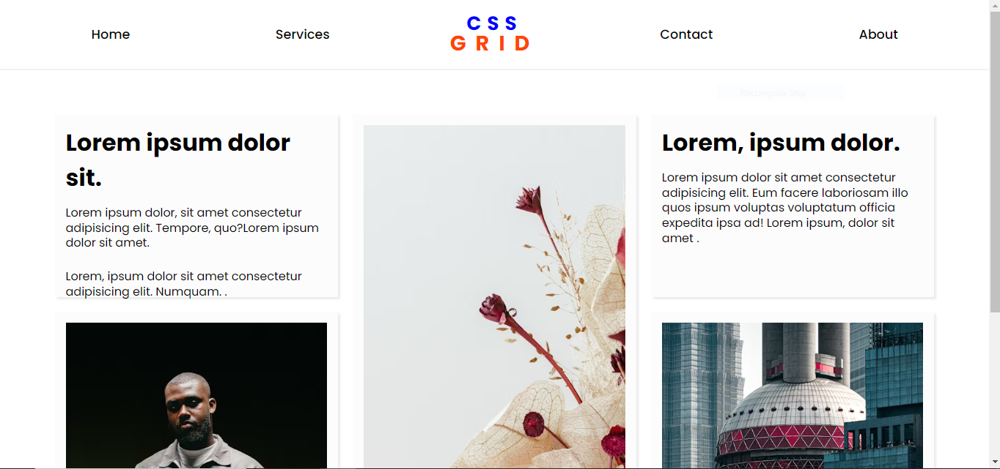
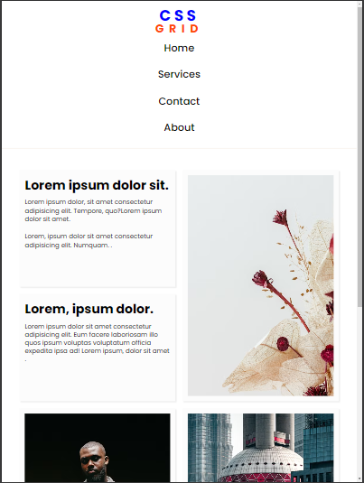

# RosemaryDesign-grid-fully-responsive

A fully responsive web layout built using **CSS Grid and SCSS** to create a structured and adaptive design that works across all devices.

## Features

- **CSS Grid Layout** for flexible and modern design
- **SCSS for styling** with maintainable structure
- **Responsive Design** that adapts to different screen sizes
- **Optimized for performance** with clean code

## How to Run

1. Clone or download the project.
2. Open `index.html` in your browser.
3. Modify the SCSS files and recompile using:
   ```bash
   sass style.scss style.css
   ```
4. Customize as needed and deploy.

## File Structure

- `index.html`: The main HTML structure of the layout.
- `style.scss`: The SCSS file containing styles.
- `style.css`: The compiled CSS file.

## Technologies Used

- HTML5
- CSS3 (SCSS Preprocessor)
- CSS Grid

## Example

After opening the project, you'll see a responsive layout where elements adjust dynamically based on screen width. The grid system ensures proper alignment and spacing.

### Screenshot





## Live Demo

[View Online](https://gdhiraj030.github.io/RosemaryDesign-grid-fully-responsive/)

## License

This project is licensed under the MIT License - see the [LICENSE](LICENSE) file for details.
